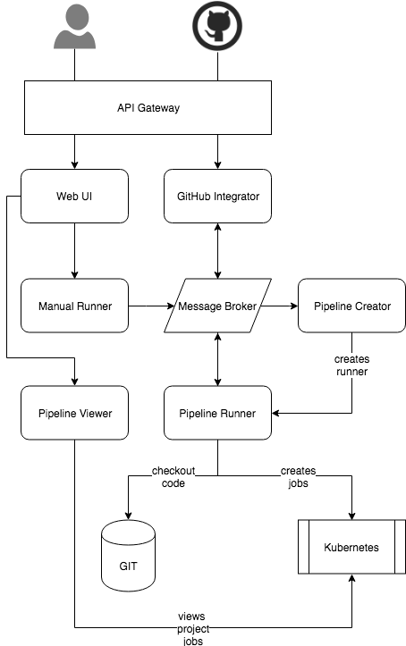

# Micro CI [](https://travis-ci.org/slamdev/micro-ci)

AIM of the project is to create kubernetis native continuous integration system. This CI allows to run build jobs as
independent pods inside of kubernetes namespace and manage requirements (cpu\memory resources, volumes, etc) per job.

Sample CI manifest:
```yaml
jobs:
- name: build
  spec:
    containers:
    - name: build
      image: golang:alpine
      command:
      - build
      env:
      - name: SOME_VAR
        value: some-value
      resources:
        limits:
          cpu: 3
          memory: 4Gi
        requests:
          cpu: 1
          memory: 2Gi
      volumeMounts:
      - mountPath: /data
        name: data-volume
```

Each spec entry should contain valid k8s pod description as specified in [Pod v1 core](https://kubernetes.io/docs/reference/generated/kubernetes-api/v1.11/#pod-v1-core)

## Arhcitecture


